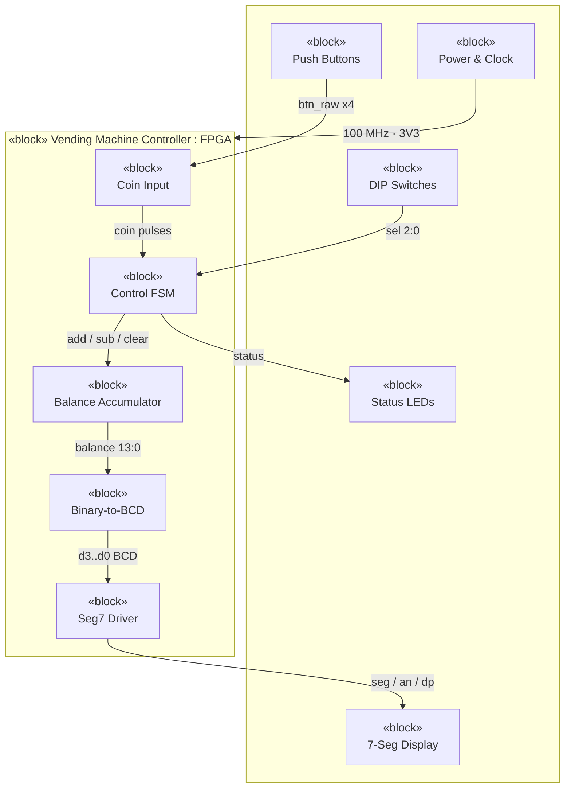

# Digital Vending Machine Controller — Concept Document

**Course:** Hardware Engineering Lab (SS 2026) · Prof. Dr.-Ing. Ali Hayek
**Institution:** Hochschule Hamm-Lippstadt (HSHL)
**Target platform:** Nexys A7-100T (FPGA: Artix-7 XC7A100T) · VHDL
**Team size:** 4

| Milestone | Date |
|---|---|
| Concept draft | 11.06.2026 |
| Final presentation | 02.07.2026 |
| Final documentation | 09.07.2026 |

---

## 1. Project idea

We design a **digital vending machine controller** in VHDL, synthesise it onto the
Artix-7 FPGA, validate it on the Nexys A7 board, and then carry the design over to a
custom PCB. The controller is the *brain* of a vending machine: it accepts coins,
keeps a running balance, lets the user select a product, and either dispenses the
product (returning change) or signals that the balance is too low.

There is **no physical coin slot or motor**. Every input is a push button or slide
switch, and every output is an LED or a seven-segment digit. This keeps the project a
clean, self-contained digital design at a **medium** level of complexity — more than a
trivial counter, but without the analog or mechanical complications of real sensors.

## 2. Motivation

A vending machine is a classic finite-state-machine (FSM) problem with a small but
real arithmetic datapath. It demonstrates the skills the course targets — FSM design,
register and counter logic, input debouncing, and time-multiplexed display driving —
while mapping onto a compact, fully digital set of peripherals that translate directly
into a manufacturable PCB.

## 3. Objectives

- Accept three coin denominations (€0.50, €1.00, €2.00) via debounced buttons.
- Maintain a running balance and display it live as `€XX.XX`.
- Offer three selectable products at fixed prices.
- Dispense when the balance is sufficient and return the correct change.
- Signal *insufficient funds* and allow the user to cancel and get a refund.
- Drive a four-digit, time-multiplexed seven-segment display.
- Deliver a complete PCB design (schematic, layout, BOM, Gerbers).

## 4. Scope

**In scope**

- FSM-based control with five states.
- Integer-cent arithmetic (accumulate, compare, subtract).
- Change returned as a **single amount** (one subtraction).
- Button debouncing and single-pulse edge detection.
- Four-digit multiplexed display driver.

**Out of scope (documented as future work)**

- Returning change as individual coin denominations (greedy change-making).
- Inventory / sold-out tracking.
- Any serial, network, or external communication.

## 5. System overview

The system is organised as one FPGA controller block connected to environment blocks
(buttons, switches, display, LEDs) and a power/clock block. Inside the controller, five
parts form a pipeline from coin input to the display.



*Colour key in the rendered view: teal = FPGA logic (our VHDL modules), grey = the
environment, amber = power and clock.*

## 6. Functional description (control FSM)

| State | Meaning | Exit condition |
|---|---|---|
| `IDLE` | Balance is zero, waiting | A coin is inserted |
| `ACCEPTING` | Coins are added; balance climbs | A product is selected |
| `CHECK` | Compare `balance ≥ price` | Decision made |
| `DISPENSE` | Sufficient funds: vend + show change | Returns to `IDLE` |
| `INSUFFICIENT` | Too low: light LOW LED, keep balance | More coins / cancel |

The cancel button moves the machine to a refund action that clears the balance from
any state. The dividing line that keeps the project at *medium* difficulty is that
change is computed as a single subtraction (`change = balance − price`), not broken
into physical coins.

## 7. Inputs and outputs

**Inputs**

| Function | Element | Signal |
|---|---|---|
| Insert €0.50 | Push button (BTNU) | `coin50` |
| Insert €1.00 | Push button (BTNL) | `coin100` |
| Insert €2.00 | Push button (BTNR) | `coin200` |
| Cancel / refund | Push button (BTND) | `refund` |
| Product select | Slide switches | `sel[2:0]` |
| Reset | Push button | `reset` |

**Outputs**

| Function | Element | Signal |
|---|---|---|
| Balance / change | 4 seven-segment digits | `seg[6:0]`, `dp`, `an[3:0]` |
| Product dispensed | Green LED | `vend` |
| Insufficient funds | Red LED | `low` |
| Coin accepted | LED (blinks) | `coin_ok` |

All seven-segment and anode lines are **active-low** on the Nexys A7.

## 8. Module breakdown

| Module | Role |
|---|---|
| `coin_button` | Synchronise + debounce a button, emit one pulse per press |
| `fsm_controller` | Five-state control logic |
| `balance_accumulator` | 14-bit running balance (cents) |
| `bin2bcd` | Binary balance → four BCD digits (double-dabble) |
| `seg7_driver` | Time-multiplexed 4-digit scan + BCD-to-segment decode |
| `top` | Wiring and I/O mapping |

Each module lives in its own `.vhd` file with a matching testbench for the FSM,
accumulator, and display driver (100 % coverage is not required).

## 9. Deliverables

- **Concept:** requirements, block diagram, peripheral list, tool list.
- **VHDL:** all source modules and libraries.
- **Verification:** testbenches.
- **FPGA:** synthesis report, screenshots, constraints (XDC), bitstream.
- **Hardware:** validation on the Nexys A7 (short video recommended).
- **PCB:** schematic, layout, 3D file, BOM, Gerber files.
- **Project management:** documented "who did what".

## 10. Suggested team roles

| Member | Responsibility |
|---|---|
| 1 | Concept, FSM design, documentation, project management |
| 2 | VHDL datapath (`balance_accumulator`, `bin2bcd`, `seg7_driver`) |
| 3 | Verification (testbenches) + FPGA implementation (XDC, synthesis, bitstream) |
| 4 | PCB design (schematic → layout → BOM → Gerbers) |

---

## Appendix A — SysML block definition diagram (PlantUML)

For a formal BDD in Papyrus or PlantUML, the composition view is:

```plantuml
@startuml
skinparam classAttributeIconSize 0
skinparam class { BackgroundColor White; BorderColor Black }

class VendingMachineController <<block>>
class CoinInput            <<block>>
class ControlFSM           <<block>>
class BalanceAccumulator   <<block>>
class BinaryToBCD          <<block>>
class Seg7Driver           <<block>>
class PushButtons          <<block>>
class DipSwitches          <<block>>
class SevenSegDisplay      <<block>>
class StatusLEDs           <<block>>
class PowerAndClock        <<block>>

VendingMachineController *-- CoinInput
VendingMachineController *-- ControlFSM
VendingMachineController *-- BalanceAccumulator
VendingMachineController *-- BinaryToBCD
VendingMachineController *-- Seg7Driver

VendingMachineController --> PushButtons      : btn_raw
VendingMachineController --> DipSwitches       : sel[2:0]
VendingMachineController --> SevenSegDisplay   : seg/an/dp
VendingMachineController --> StatusLEDs        : status
PowerAndClock --> VendingMachineController     : 100 MHz / 3V3
@enduml
```
